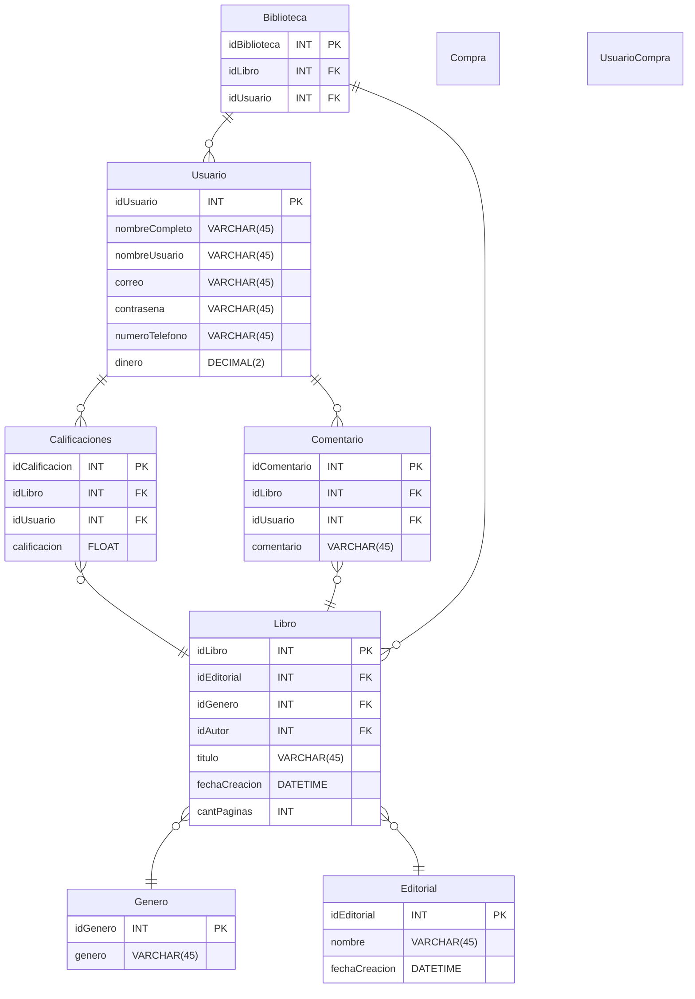

# ***Se Pico***

## Ahora vamos a unir todo lo que aprendimos:

### Una vez vistos el tema 1 de netcore y el las partes 1 y 2 de RAZOR/Blazor, nos queda enlazar todo, vamos a trabajar bajo el siguiente DER:



# 1- Creando el proyecto:

## Creamos un Proyecto Web:

### Para crear un Proyecto Web, Pondremos los siguientes comandos por consola:

```bash
dotnet new web -n nombreDeTuProyecto
cd nombreDeTuProyecto
mkdir wwwroot
mkdir Shared
mkdir Models
mkdir Pages
mkdir Data
```

## Ahora, vamos a seguir los pasos para la creación del Tutorial MiBlazorDesdeCero, la parte 1 y 2

