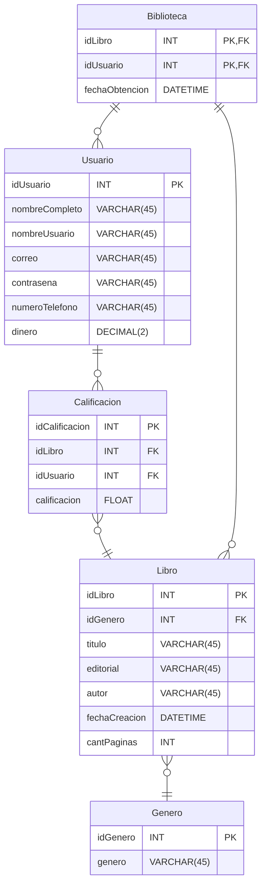

# ***Proyecto Netflix de Libros***
# **Materia: Proyecto**

<br>

# ¡¡¡ACLARACIÓN!!! 
## (Todos los cambios que realice en la aplicación desde los formularios se borrara al ejecutar de vuelta el proyecto, solo se mantienen los cambios realizados manualmente en el código)

<br>

# Configuración Inicial
## Recuerda crear tu archivo appsettings.json en la raiz del proyecto.

### Codigo a ingresar dentro del archivo appsettings.json:


```json
{
  "Logging": {
    "LogLevel": {
      "Default": "Information",
      "Microsoft.AspNetCore": "Warning"
    }
  },
  "AllowedHosts": "*",

  "ConnectionStrings": {
    "DefaultConnection": "server=localhost;database=ProyectoBiblioteca;user=tu_user;password=tu_contraseña;"
  }
}
```

<br>

## Usuarios por defecto:

- ### Nombre Usuario: LUKITA7956    Contraseña: luka1234
- ### Nombre Usuario: SEBITA7956    Contraseña: seba1234

<br>

## Si utilizas Windows, puedes ejecutar el archivo .bat, el cual iniciara la aplicación automaticamente (creo..)

<br><br>

# DER:

